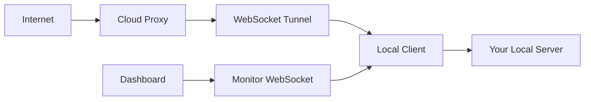

# Local Tunnel Proxy System

A powerful, self-hosted reverse proxy tunnel system similar to ngrok, built with Node.js & uWebsocket.js for speed. Exposes your local HTTPS services to the internet through a cloud proxy with real-time monitoring and logging.

## 🚀 Features

- **Secure HTTPS Tunneling** - SSL/TLS encryption end-to-end
- **Real-time Dashboard** - Live monitoring with WebSocket updates
- **Cloud Proxy Integration** - Connect through remote proxy servers
- **Advanced Logging** - Color-coded, filterable logs with export functionality
- **Auto-reconnection** - Resilient connection with automatic retry logic
- **Modern UI** - Beautiful, responsive dashboard built with EJS and modern CSS
- **Modular Architecture** - Clean, maintainable codebase structure

## 📁 Project Structure

```
Tunnel/
├── Local/              # Local tunnel client
│   ├── app.js         # Main tunnel client application
│   ├── web.js         # Web interface manager
│   ├── configs/       # Configuration modules
│   │   ├── index.js   # Config exports
│   │   ├── log.js     # Logging system
│   │   └── web.js     # Express setup
│   ├── routes/        # Express routes
│   ├── views/         # EJS templates
│   ├── static/        # CSS/JS assets
│   ├── wss/           # WebSocket servers
│   ├── ssl/           # SSL certificates
│   └── logs/          # Log files
└── Proxy/             # Cloud proxy server
    ├── app.js         # Proxy server
    ├── Dockerfile     # Container configuration
    └── fly.toml       # Fly.io deployment config
```

## 🛠️ Quick Start

### Prerequisites

- Node.js 16+ 
- SSL certificates (self-signed or CA-issued)
- Access to a cloud server for the proxy (optional)

### Local Setup

1. **Clone and install dependencies:**
   ```bash
   cd Tunnel/Local
   npm install
   ```

2. **Configure environment:**
   ```bash
   cp .env.example .env
   # Edit .env with your settings
   ```

3. **Setup SSL certificates:**
   ```bash
   # Place your certificates in ssl/
   ssl/
   ├── cert.pem
   └── key.pem
   ```

4. **Start the tunnel:**
   ```bash
   npm start
   ```

5. **Access dashboard:**
   Open `http://localhost:8080` in your browser

### Environment Variables

```bash
# Required
CLOUD_PROXY_URL=wss://your-proxy-server.com:3001
LOCAL_SERVER_URL=https://localhost:3000
AUTH_TOKEN=your-secret-token-here

# Optional
RECONNECT_INTERVAL=5000
MAX_RECONNECT_ATTEMPTS=10
WEB_INTERFACE_PORT=8080
```

## 🎯 How It Works



1. **Cloud Proxy** receives HTTP requests from the internet
2. **WebSocket Tunnel** forwards requests to your local client
3. **Local Client** processes requests and forwards to your local server
4. **Response** travels back through the same tunnel
5. **Dashboard** monitors all traffic in real-time

## 📊 Dashboard Features

### Live Statistics
- Total requests processed
- Active connections
- Success/error rates  
- Average response times

### Real-time Logs
- Color-coded log levels (local, proxy, server, error, warn)
- Live filtering and search
- Export functionality
- Auto-scroll with manual override

### Interactive Controls
- Clear logs
- Toggle auto-scroll
- Filter by log type
- Search log content
- Copy individual log entries
- Highlight important logs

## 🔧 Configuration

### Logging System

The modular logging system supports:

```javascript
// Usage in code
log('local', 'Application started');
log('proxy', 'Connected to cloud proxy');  
log('server', 'Processing request');
log('error', 'Connection failed');
log('warn', 'Retrying connection');
```

Features:
- Console output with colors
- File logging to `logs/tunnel.log`
- Real-time dashboard updates via WebSocket
- Automatic log rotation

### SSL Configuration

For HTTPS tunneling, place your certificates in the `ssl/` directory:

```bash
ssl/
├── cert.pem    # Your SSL certificate
└── key.pem     # Your private key
```

The system supports:
- Self-signed certificates for development
- CA-issued certificates for production
- Automatic certificate validation

### WebSocket Configuration

Two WebSocket servers run simultaneously:
- **Port 8080**: Web interface (HTTP/Express)
- **Port 8081**: Monitor WebSocket for dashboard updates

## 🚀 Deployment

### Cloud Proxy (Fly.io)

```bash
cd Tunnel/Proxy
fly deploy
```

### Local Client (Systemd Service)

```bash
sudo cp tunnel-client.service /etc/systemd/system/
sudo systemctl enable tunnel-client
sudo systemctl start tunnel-client
```

## 🔐 Security

- **End-to-end SSL/TLS** encryption
- **Token-based authentication** between client and proxy
- **Certificate validation** for HTTPS connections
- **Self-signed certificate support** for local development

## 🛠️ Development

### Adding New Features

1. **Logging**: Use the modular `log(kind, message)` function
2. **Dashboard**: Add new WebSocket message types in `handleMessage()`
3. **Routes**: Add Express routes in `routes/` directory
4. **Styles**: Follow the CSS variable system in `static/css/vars.css`

### Code Style

- **Short, clear names** - no unnecessary prefixes/suffixes
- **Modular structure** - separate concerns into different files
- **Consistent exports** - use standard module.exports patterns
- **Error handling** - comprehensive error catching and logging

## 📝 API Reference

### WebSocket Messages

```javascript
// Log message
{
  type: 'log',
  kind: 'server|proxy|local|error|warn',
  message: 'Log content',
  timestamp: '2025-06-30T10:30:00.000Z'
}

// Request message  
{
  type: 'request',
  method: 'GET',
  url: '/api/data',
  requestId: 'abc123...'
}

// Response message
{
  type: 'response', 
  statusCode: 200,
  method: 'GET',
  url: '/api/data',
  requestId: 'abc123...',
  responseTime: 150
}
```

## 🐛 Troubleshooting

### Common Issues

**WebSocket Connection Failed**
- Check if ports 8080/8081 are available
- Verify firewall settings
- Ensure WebSocket server is running

**SSL Certificate Errors**
- Verify certificate files in `ssl/` directory
- Check certificate validity and format
- For self-signed certs, add to trusted certificates

**Proxy Connection Issues**
- Verify `CLOUD_PROXY_URL` is correct
- Check `AUTH_TOKEN` matches proxy server
- Ensure network connectivity to proxy

### Debug Mode

```bash
DEBUG=true npm start
```

## 📄 License

MIT License - see LICENSE file for details

## 🤝 Contributing

1. Fork the project
2. Create feature branch (`git checkout -b feature/amazing-feature`)
3. Commit changes (`git commit -m 'Add amazing feature'`)
4. Push to branch (`git push origin feature/amazing-feature`)
5. Open Pull Request

## 📞 Support

- 📧 Email: support@example.com
- 🐛 Issues: [GitHub Issues](https://github.com/username/tunnel-proxy/issues)
- 📖 Docs: [Full Documentation](https://docs.example.com)

---

**Built with ❤️ using Node.js, Express, uWebSockets.js, and modern web technologies**
